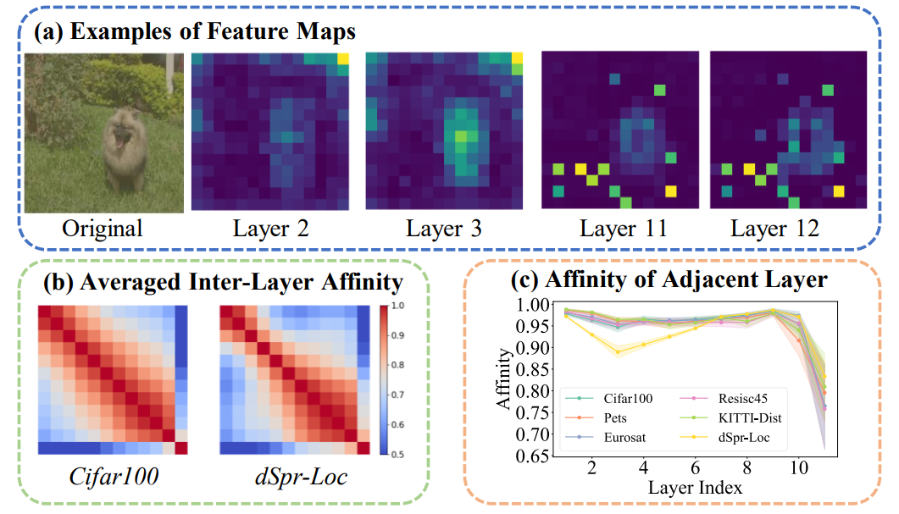
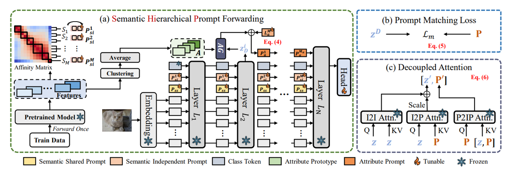

# Semantic Hierarchical Prompt Tuning for Parameter-Efficient Fine-Tuning (ICASSP 2025)
This is the official repository of  [Semantic Hierarchical Prompt Tuning for Parameter-Efficient Fine-Tuning](https://arxiv.org/abs/2412.16956).

<hr />

## 1. Highlights



> **<p align="justify"> Abstract:** *As the scale of vision models continues to grow, Visual Prompt Tuning (VPT) has emerged as a parameter-efficient transfer learning technique, noted for its superior performance compared to full fine-tuning. However, indiscriminately applying prompts to every layer without considering their inherent correlations, can cause significant disturbances, leading to suboptimal transferability. Additionally, VPT disrupts the original self-attention structure, affecting the aggregation of visual features, and lacks a mechanism for explicitly mining discriminative visual features, which are crucial for classification. To address these issues, we propose a Semantic Hierarchical Prompt (SHIP) fine-tuning strategy. We adaptively construct semantic hierarchies and use semantic-independent and semantic-shared prompts to learn hierarchical representations. We also integrate attribute prompts and a prompt matching loss to enhance feature discrimination and employ decoupled attention for robustness and reduced inference costs. SHIP significantly improves performance, achieving a 4.9% gain in accuracy over VPT with a ViT-B/16 backbone on VTAB-1k tasks.* </p>

<hr />


## 2. Method Pipeline


Please refer to the [paper](https://arxiv.org/abs/2412.16956) for more technical details.

<hr />

## 3. How to Run Experiments?

### Environment Setup
```
conda create -n SHIP python=3.10.6
conda activate SHIP
pip install -r requirements.txt
```

### Data and Pre-trained Model Preparation
* Download the [VTAB-1k](https://github.com/google-research/task_adaptation) benchmark and put them to `"data/vtab-1k"`.
* Download the pre-trained [ViT B/16](https://storage.googleapis.com/vit_models/imagenet21k/ViT-B_16.npz) model.

### Train
```
bash run.sh
```

### 4. Performance
Please refer to `results_summary.txt` for the performance metrics and corresponding hyperparameter configurations.


<hr />

## Citation

If you find our work inspiring in your research, please cite our work.

```
@article{zhu2024semantichierarchicalprompttuning,
      title={Semantic Hierarchical Prompt Tuning for Parameter-Efficient Fine-Tuning}, 
      author={Haowei Zhu and Fangyuan Zhang and Rui Qin and Tianxiang Pan and Junhai Yong and Bin Wang},
      journal={2024 preprint arXiv:2412.16956},
      year={2024}
}
```

<hr />
